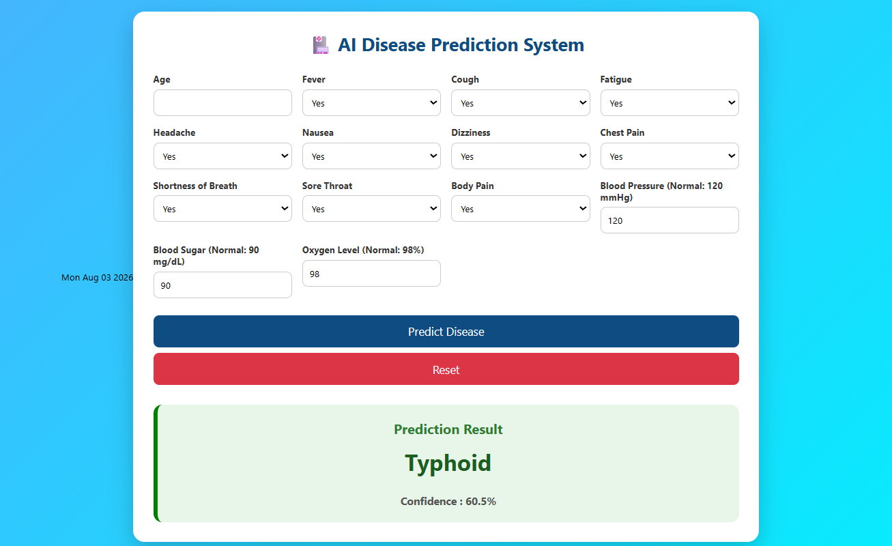

# 🩺 AI Disease Prediction System

An AI-powered Disease Prediction System built using **Python, Flask, Machine Learning, HTML, CSS, and JavaScript**. This application predicts the most probable disease based on user symptoms and basic health parameters.

---

## 📌 Project Overview

The AI Disease Prediction System helps users identify possible diseases by entering symptoms and basic health information such as:

- Age
- Fever
- Cough
- Fatigue
- Headache
- Nausea
- Dizziness
- Chest Pain
- Shortness of Breath
- Sore Throat
- Body Pain
- Blood Pressure
- Blood Sugar
- Oxygen Level

The system processes the inputs using a trained Machine Learning model and predicts the most likely disease along with the confidence score.

---

# 🚀 Features

- 🤖 Machine Learning Disease Prediction
- 💻 Simple and User-Friendly Interface
- 📊 Prediction Confidence Score
- 🩺 Multiple Symptom Input
- ❤️ Blood Pressure Input
- 🍬 Blood Sugar Input
- 🫁 Oxygen Level Input
- 🔄 Reset Button
- 📱 Responsive Design
- 🌐 Flask Web Application
- ☁️ Deployable on Render

---

# 🛠️ Technologies Used

| Technology | Purpose |
|------------|----------|
| Python | Backend |
| Flask | Web Framework |
| Scikit-Learn | Machine Learning |
| Pandas | Data Processing |
| NumPy | Numerical Operations |
| HTML5 | Frontend |
| CSS3 | Styling |
| JavaScript | Form Handling |
| Bootstrap | Responsive UI |

---

# 📂 Project Structure

```
AI-Disease-Prediction/
│
├── app.py
├── model.pkl
├── requirements.txt
├── templates/
│     └── index.html
│
├── static/
│     ├── css/
│     ├── js/
│     └── images/
│
├── screenshots/
│     ├── Home page.png
│     └── result.png
│
└── README.md
```

---

# ⚙️ Installation

## Clone Repository

```bash
git clone https://github.com/morthasandeep777/AI-Disease-Prediction.git
```

Move into project folder

```bash
cd AI-Disease-Prediction
```

Install dependencies

```bash
pip install -r requirements.txt
```

Run Flask Application

```bash
python app.py
```

Open your browser

```
http://127.0.0.1:5000/
```

---

# 📷 Application Screenshots

## 🏠 Home Page

<p align="center">

</p>

---

## 🩺 Prediction Result

<p align="center">

</p>

---

# 🧠 Machine Learning Workflow

```
User Input
      │
      ▼
Data Preprocessing
      │
      ▼
Feature Encoding
      │
      ▼
Trained ML Model
      │
      ▼
Disease Prediction
      │
      ▼
Confidence Score
```

---

# 🎯 Future Enhancements

- User Login System
- Prediction History
- PDF Medical Report
- Doctor Recommendation
- AI Chatbot
- Voice Symptom Input
- Dark Mode
- Mobile Application
- Email Report
- Cloud Database Integration

---

# 📖 Learning Outcomes

This project helped in understanding:

- Machine Learning Integration
- Flask Web Development
- Frontend-Backend Communication
- Model Deployment
- Data Processing
- User Interface Design

---

# 👨‍💻 Author

## Mortha Sandeep

B.Tech - Artificial Intelligence & Machine Learning

Aditya University

GitHub:

https://github.com/morthasandeep777

---

# ⭐ Support

If you found this project useful,

⭐ Star this repository

🍴 Fork this repository

🛠️ Contribute to improve it

---

# 📜 License

This project is developed for educational and learning purposes.
